#HiCPlotter: Visualization of Hi-C data with genomic datasets

# About HiCPlotter

HiCPlotter is a Python data visualization tool for integrating different data types with interaction matrixes. For more on 5C or Hi-C, please check:  <a class="reference external" href="http://www.nature.com/nrg/journal/v14/n6/full/nrg3454.html"> Dekker et al. 2013</a>.

If you use HiCPlotter in your studies, please cite our publication in Genome Biology (http://www.genomebiology.com/2015/16/1/198)

_HiCPlotter is designed by Kadir Akdemir (kcakedemir at mdanderson dot org / find me on [Twitter](https://twitter.com/kcakdemir)) while in Lynda Chin's Lab at the University of Texas MD Anderson Cancer Center, Houston, TX, USA._

# Requirements

Python 2.7.*

[Numpy, Scipy, Matplotlib](http://www.scipy.org/).

* Please note: scipy, numpy and matplotlib modules should be installed and updated to current version. Following versions of numpy (1.9.0, 1.9.2, 1.10.4), scipy(0.14.0, 0.15.1, 0.17.0) and matplotlib(1.3.1, 1.4.3, 1.5.1) have been tested successfully.
* If you receive error(s) related to one or more of these modules, check this [solution](https://github.com/kcakdemir/HiCPlotter/issues/1) and/or check versions of python and required modules.

_HiCPlotter is tested on Mac OS (Mountain Lion and Yosemite) and Linux (RedHat 4.1.2-44 and 5.5-Final) systems._

_HiCPlotter is purposefully designed with the least amount of dependencies to make it easily applicable._

# Contents

1. [Input Files](#inputfiles)
2. [Basic Usage](#usage)
3. [Drawing Genes](#genes)
4. [Tracks](#tracks)
   1. [Histograms](#histograms)
   2. [Bar plots](#barplots)
   3. [Arcs](#arcs)
   4. [Tile plots](#tileplots)
   5. [Epilogos plotting](#epilogos)
   6. [Domains](#domains)
5. [Highlights](#highlights)
6. [Annotation](#annotation)
7. [Whole Genome Plots](#wholegenome)
8. [5C Plots](#5c)
9. [Matrix Comparisons](#Comparison)

# Arguments

_For reading more about each parameter, please check the [manual](HiCPlotterManual.pdf)._

	Required parameters:

    files 			(-f)		: a list of filenames to be plotted.
    name 			(-n) 		: a list of labels for the experiment.
    chr				(-chr)		: chromosome to be plotted.
    output			(-o)		: prefix for the output file.
    
    Optional parameters:
    
    verbose			(-v)		: print version and arguments into a file.
    tripleColumn	(-tri)		: a boolean if input file is from HiC-Pro pipeline.
    bedFile			(-bed)		: a file name for bin annotations, if -tri parameter is set.
    plotGenes		(-g)		: a sorted bed file for plotting the locations of the genes.
    geneLabels		(-gl)		: a boolean for plotting gene labels (1:default) or not (0).
    histograms		(-hist)		: a list of filenames to be plotted as histogram.
    histLabels		(-h)		: a list of labels for the histograms.
    fillHist		(-fhist)	: a list whether each histogram will be filled (1) or not (0:default).
    histColors		(-hc)		: a list of hexadecimal numbers for histogram filling colors.
    histMax 		(-hm)		: a list of integer for maximum values of histograms.
    start			(-s)		: retain after x-th bin (0:default).
    end				(-e)		: continues until x-th bin (default: length of the matrix).
    resolution		(-r)		: resolution of the bins (default: 100000).
    matrixMax		(-mm)		: an integer value for the interaction matrix heatmap scale upper-limit.
    barPlots		(-b)		: a list of filenames to be plotted as bar plots.
    barLabels		(-bl)		: a list of labels for the bar plots.
    barColors		(-bc)		: a list of hexadecimal numbers for coloring the bar plots.
    barMax	 		(-bm)		: a list of integer for maximum values of bar plots.
    tilePlots		(-t)		: a list of filenames to be plotted as tile plots.
    tileLabels		(-tl)		: a list of labels for the tile plots.
    tileColors		(-tc)		: a list of hexadecimal numbers for coloring the tile plots.
    tileText		(-tt)		: a boolean whether text will be displayed above tiles (0:default) or not (1).
    arcPlots		(-a)		: a list of filenames to be plotted as arc plots.
    arcLabels		(-al)		: a list of labels for the arc plots.
    arcColors		(-ac)		: a list of hexadecimal numbers for coloring the arc plots.
    highlights		(-high)		: a boolean for enabling highlights on the plot (0:default), enable(1). 
    highFile		(-hf)		: a file name for a bed file to highlight selected intervals.
    peakFiles 		(-peak)		: a list of filenames to be plotted on the matrix.
    compare			(-c)		: a boolean to plot log2 compare first two matrices (default:0) enable(1).
    pair			(-p)		: a boolean to plot log2 pair-wise matrix comparisons (default:0) enable(1).
    spine			(-spi)		: a boolean to remove top and left borders for each tracks (default:0) enable(1).
    epiLogos 		(-ep)		: a filename to be plotted as Epilogos format.
    oExtension 		(-ext)		: an extension name for the output file format - default jpeg.
    imputed 		(-im)		: a boolean if imputed epilogos will be plotted. (default:0 for observed)
    window			(-w)		: an integer of distance to calculate insulation score.
    tadRange		(-tr)		: an integer of window to calculate local minima for TAD calls.
    fileHeader		(-fh)		: an integer for how many lines should be ignored in the matrix file (1:default).
    fileFooter		(-ff)		: an integer for how many lines should be skipped at the end of the matrix file (0:default).
    smoothNoise		(-sn)		: a floating-point number to clean noise in the data.
    heatmapColor	(-hmc)		: an integer for choosing heatmap color codes: Greys(0), Reds(1), YellowToBlue(2), YellowToRed(3-default), Hot(4), BlueToRed(5).
    cleanNANs		(-cn)		: a boolean for replacing NaNs in the matrix with zeros (1:default) or not (0).
    plotTriangular	(-ptr)		: a boolean for plotting rotated half matrix (1:default) or not (0).
    plotTadDomains	(-ptd)		: a boolean for plotting TADs identified by HiCPlotter (1) or not (0:default).
    plotPublishedTadDomins	(-pptd)	: a boolean for plotting TADs from Dixon et, al. 2012 (1:default) or not (0).
    plotDomainsAsBars		(-ptdb)	: a boolean for plotting TADs as bars (1) instead of triangles (0:default)
    highResolution	(-hR)		: a boolean whether plotting high resolution (1:default) or not (0).
    dPixels			(-dpi)		: an integer to determine dots per inch in matrix, higher values for higher resolution (default:200).
    plotInsulation	(-pi)		: a boolean for plotting insulation scores (0:default) or plot (1).
    randomBins		(-rb)		: a boolean for plotting random resolution data (1:default) or not (0).
    wholeGenome		(-wg)		: a boolean for plotting whole genome interactions (1:default) or not (0).
    plotCustomDomains		(-pcd)	: a list of file names to be plotted beneath the matrix.
    domColors		(-dc)		: a list of hexadecimal numbers for coloring the domain plots.
    publishedTadDomainOrganism 	(-ptdo)	: a boolean for plotting human (1:default) or mouse (0) TADs from Dixon et, al. 2012.
    customDomainsFile			(-pcdf)	: a list of filenames to be plotted as TADs for each experiments.

## Input Files 

## Hi-C/5C matrix data

For visualizing Hi-C or 5C data, HiCPlotter requires a matrix file (by default first line is ignored).

Matrix files are plotted as their log2 values and color legend is put below the plot.

	Bin1	Bin2	Bin3	Bin4	Bin5	Bin6
	7.85957	4.80329	11.4766	9.57416	4.5288	8.55022
	8.61621	4.98956	2.35654	5.69483	11.1187	10.1322
	4.06803	4.07801	7.98047	2.59144	6.3851	7.74306
	4.52869	2.70624	8.94544	4.29185	8.29491	8.38257
	2.91472	3.84658	1.56752	4.48515	7.4955	8.77461
	3.08096	2.96487	7.23623	2.33142	3.08529	5.5379
	3.12141	3.06905	4.97247	2.39298	5.03621	7.22344
	3.4037	2.26455	1.48176	1.41958	3.40252	7.7027
	3.8696	1.41425	7.68872	2.21027	5.06846	3.20063

If your file (example is modified from [GSM873926](www.ncbi.nlm.nih.gov/geo/query/acc.cgi?acc=GSM873926)) has several header lines, use -fh parameter (this particular case -fh 5).
	
	# resultName	mESCs-female-PGK-day2-Replicate1			
	#				
	#				
	#
	REV_2|mm9|chrX:98831149-98834145	REV_4|mm9|chrX:98837507-98840771	REV_6|mm9|chrX:98841228-98843248	REV_12|mm9|chrX:98855723-98862021
	936.010581657246					743.499513378904					241.956223702097					23.2451328286973
	69.8831429744098					513.412096905019					747.143877424081					7.1902317648089

If your file is in bed file format as in [GSM1081531](http://www.ncbi.nlm.nih.gov/geo/query/acc.cgi?acc=GSM1081531), you can covert it to a matrix file with bedToMatrix.py in Utils directory.
Each file should have data from one chromosome. To split the file, you can use -> awk '{if($1=="chr6") print}' [file] > [newfile]	

	chr6	80000_120000	120000_160000	10.278
	chr6	80000_120000	160000_200000	3.648
	chr6	80000_120000	200000_240000	4.204
	
	*run python bedToMatrix.py [file_name] 

### Triplet sparse format

HiCPlotter now accepts the output format of HiC-Pro [pipeline](https://github.com/nservant/HiC-Pro), where the matrix file is a three column sparse format in which first two columns are interacting bins and third column is interaction frequency. Bins do not interact with each other (with score 0) are not listed in the file. 
	
	1050	1586	1
	1050	1589	1
	1050	1590	1 (jumps to 1612)
	1050	1612	2

An annotation file (bed format) is also required to denote each bin's chromosomal locations. Fourth column is the bin number inside the matrix file.

	chr1	20960000	20980000	1049
	chr1	20980000	21000000	1050
	chr1	21000000	21020000	1051
	chr1	21020000	21040000	1052
	chr1	21040000	21060000	1053
	chr1	21060000	21080000	1054
	chr1	21080000	21100000	1055
	
User should set -tri parameter to 1 and provide the bin-annotation bed file with -bed FILENAME. An example usage:
	
	python HiCPlotter.py -f GSE35156_GSM892306_hESC.40000.matrix -chr chr7 -o Example -r 40000 -tri 1 -bed GSE35156_GSM892306_hESC.40000_ord.bed -n hES -s 650 -e 700 

## BedGraph

For visualizing any type of genomic data, HiCPlotter uses bedGraph format.
	
	
	chromA  chromStartA  chromEndA  dataValueA color (optional)     text (optional)
	chr1	10000		 10500		10.0	   250,13,27		   Polycomb

4th column should be a floating number for histograms.

5th column should be an rgb color for tile or arc plots. 

6th column should be a string for tile plots. _Columns after 6th will be ignored._

## Peak File

For annotating the interaction matrix, HiCPlotter requires the following format.
	
	chromA	chromStartA  chromEndA	chromB	chromStartB chromEndB	color (optional)
	chr10	100180000	100190000	chr10	100410000	100420000	0,255,255
	chr10	101600000	101610000	chr10	101800000	101810000	0,255,255
	chr10	102100000	102105000	chr10	102190000	102195000	0,255,255

## Gene File

For plotting genes under the interaction matrix, HiCPlotter requires the following format.
	
	
	chrom  geneStart  geneEnd	geneName	strand(optional)	exonStarts(optional)	exonEnds(optional)	color (optional)
	chr1	11873		 14409	DDX11L1		+					11873,12645,13220,		12227,12697,14409,	250,13,27
	chr1	14361		 16765	WASH7P		-					14361,14969,15795,16606,		14829,15038,15942,16765,
	chr1	14361		 19759	WASH7P		-					14361,14969,15795,16606,16857,17232,17605,17914,18267,18912,		14829,15038,15947,16765,17055,17368,17742,18061,18366,19759,

This file should be sorted based on 2nd column (geneStart).

For 6th (exonStarts) and 7th (exonEnds) columns, there should be a comma at the very end.

If 5th column is provided then 6th and 7th columns should be provided as well.

# Usage 

	python HiCPlotter.py -f file1 file2 -n name1 name2 -chr chrX -o output

_**You can generate all of the following examples by using "sh testRun.sh", all of required files are in the data folder.**_

## Plotting whole chromosome
_Please note: -fh is set to 0 as the input matrix doesn't have a header line._

_Hi-C and TADs data taken from:_ [Dixon et, al. Nature 2012](http://www.nature.com/nature/journal/v485/n7398/full/nature11082.html?WT.ec_id=NATURE-20120517)

	python HiCPlotter.py -f data/HiC/Human/hES-nij.chr21.2 -n hES -chr chr21 -r 40000 -o default1 -fh 0

<figure>
  <figcaption align="middle">**Chromosome interactions at chromosome 21 in human ES cells**</figcaption>
  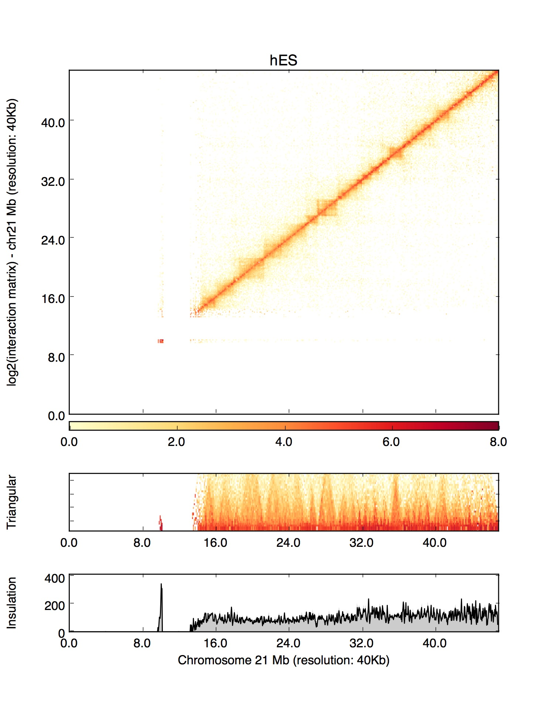
</figure>

## Focusing to a region within a chromosome
_Start and end locations can be specified as bin numbers with -s and -e parameters._

_Color of triangles specify interaction frequency in a given TAD._

_TADs identified by Dixon et al. can be plotted with -pptd parameter._	

_TADs can be plotted as bars instead of triangles with -pdb parameter._
	
	python HiCPlotter.py -f data/HiC/Human/hES-nij.chr21.2 -n hES -chr chr21 -r 40000 -o default2 -ptd 1 -pptd 1 -s 600 -e 900 -fh 0 -w 8 -tr 10 -pi 1

<figure>
  <figcaption align="middle">**Chromosome interactions at chromosome 21 in human ES cells**</figcaption>
  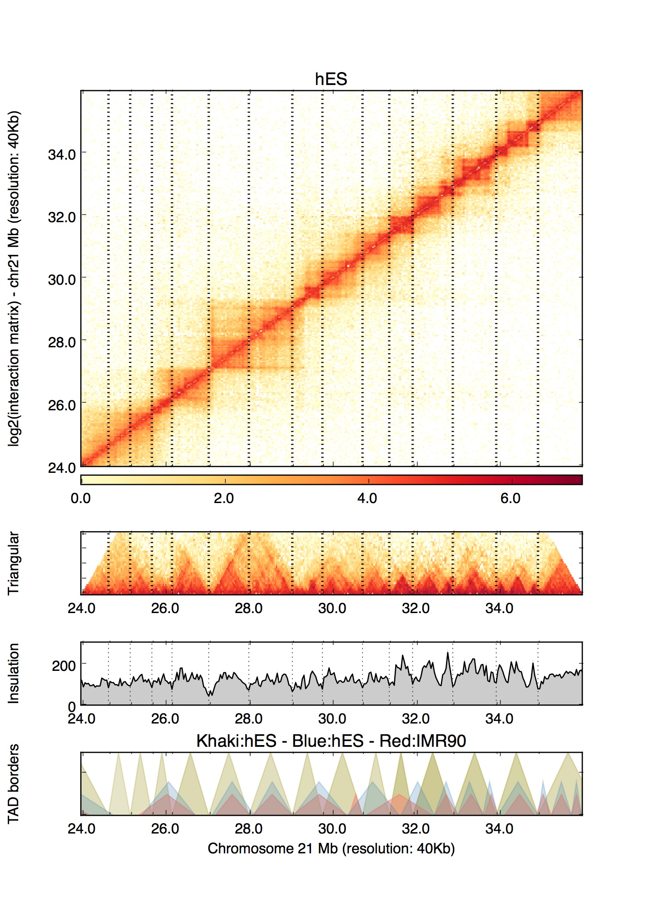
</figure>

	python HiCPlotter.py -f data/HiC/Human/hES-nij.chr21.2 -n hES -chr chr21 -r 40000 -o default2 -ptd 1 -pptd 1 -s 600 -e 900 -fh 0 -w 8 -tr 10 -pi 1 -pdb 1

<figure>
  <figcaption align="middle">**Domains as bars**</figcaption>
  
</figure>

## Visualization of multiple Hi-C datasets

_Hi-C data taken from:_ [Zuin et, al. PNAS 2014](http://www.pnas.org/content/111/3/996.long)

_Color code of the heatmaps can be changed with -hmc parameter_
	
 	python HiCPlotter.py -f data/HiC/Human/GSM1081526_TEV_r1_cis.index.chr6.txt_matrix.txt data/HiC/Human/GSM1081528_HRV_r1_cis.index.chr6.txt_matrix.txt data/HiC/Human/GSM1081530_CTRL_r1_cis.index.chr6.txt_matrix.txt data/HiC/Human/GSM1081533_CTCF_r2_cis.index.chr6.txt_matrix.txt -n WT RAD21-Depleted siControl CTCF-Depleted -chr chr6 -r 40000 -fh 0 -pi 0 -sn 0.35 -o Rad21.CTCF -s 2800 -e 2950 -hmc 5

<figure>
  <figcaption align="middle">**Chromosome interactions for wild type, RAD21-depleted, CTCF-depleted cells.**</figcaption>
  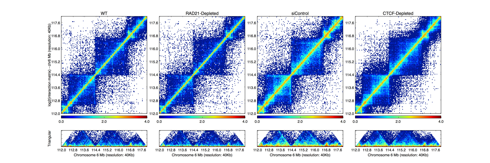
</figure>

# Plotting Genes 

_Saving the output file as a pdf gives better output compared to default jpeg file._

	python HiCPlotter.py -f data/HiC/Human/IMR90-chr10_25kb.RAWobserved_KRnormalizedMatrix.txt -o genes -n IMR90 -chr chr17 -g genes.sorted.bed -r 25000 -s 1800 -e 1850 -hist data/HiC/Human/IMR90.Rad21.bedGraph -hl Rad21 -hm 500 -ext pdf
	
<figure>
  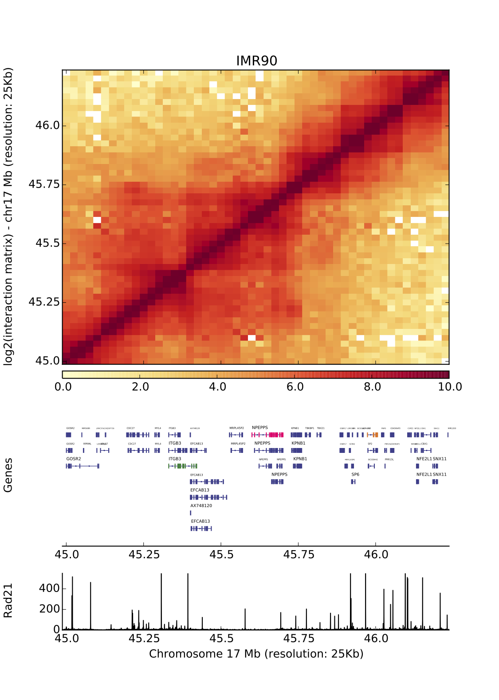
</figure>

# Adding Tracks 

## Histogram Plotting 

_Multiple histograms for the same matrix should be seperated by comma (true for hist labels and fill histogram parameters)._

_Data taken from:_ 4C : [Noordermer et, al. Elife 2014](http://elifesciences.org/content/3/e02557), Hi-C and TADs : [Dixon et, al. Nature 2012](http://www.nature.com/nature/journal/v485/n7398/full/nature11082.html?WT.ec_id=NATURE-20120517) and CTCF : [Stadler et, al. Nature 2011](http://www.nature.com/nature/journal/v480/n7378/full/nature10716.html)

	python HiCPlotter.py -f data/HiC/Mouse/mES.chr2 -n mES -chr chr2 -r 40000 -o HoxD -hist data/HiC/Mouse/GSM1334415_4C_Mouse_EScells_Hoxd4_smoothed_11windows.bedGraph,data/HiC/Mouse/GSM1334440_4C_Mouse_E9.5TB_Hoxd4_smoothed_11windows.bedGraph,data/HiC/Mouse/GSM1334412_4C_Mouse_EScells_Hoxd13_smoothed_11windows.bedGraph,data/HiC/Mouse/GSM1334437_4C_Mouse_E9.5TB_Hoxd13_smoothed_11windows.bedGraph,data/HiC/Mouse/GSM747534_ChIPseq_CTCF_ES_rep1.chr2.bedGraph -hl Hoxd4-ES,Hoxd4-Tail,Hoxd13-ES,Hoxd13-Tail,CTCF-ES -s 1830 -e 1880 -fh 0 -pi 0 -pcd 1 -pcdf data/mES_domains_mm9.bed -fhist 1,1,1,1,0 -hm 2000,2000,2000,2000,50

<figure>
  <figcaption align="middle">**3D compartments in the HoxD cluster in mouse ES cells**</figcaption>
  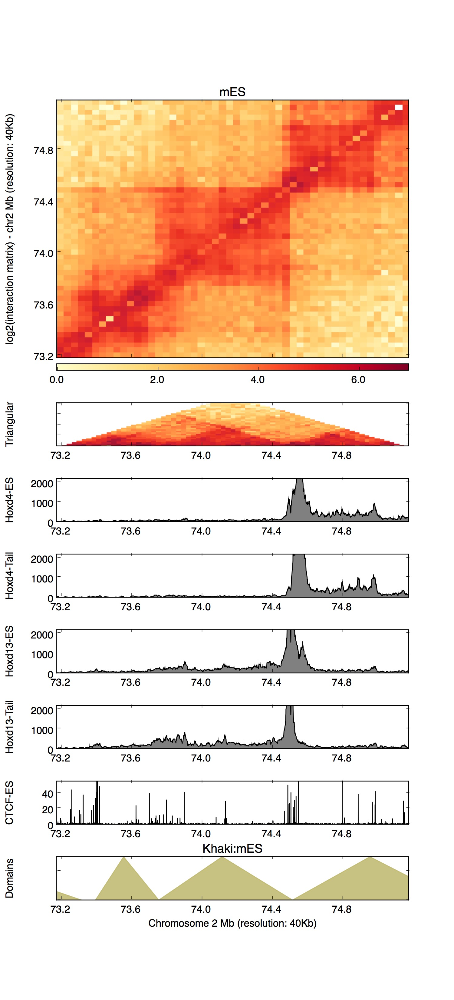
</figure>

_Color for area under the curve fillings can be specific as a hexadecimal number with -hc parameter._

	python HiCPlotter.py -f data/HiC/Mouse/mES.chr2 -n mES -chr chr2 -r 40000 -o HoxDc -hist data/HiC/Mouse/GSM1334415_4C_Mouse_EScells_Hoxd4_smoothed_11windows.bedGraph,data/HiC/Mouse/GSM1334412_4C_Mouse_EScells_Hoxd13_smoothed_11windows.bedGraph -hl Hoxd4-ES,Hoxd13-ES -s 1830 -e 1880 -fh 0 -pi 0 -pcd 1 -pcdf data/mES_domains_mm9.bed -fhist 1,1 -hm 2000,2000 -hc 143D52,9ACD32

<figure>
  <figcaption align="middle">**Colored Histograms**</figcaption>
  
</figure>

_To remove frames for each track, use --spine (-spi) 1 parameter._

	python HiCPlotter.py -f data/HiC/Mouse/mES.chr2 -n mES -chr chr2 -r 40000 -o HoxDcs -hist data/HiC/Mouse/GSM1334415_4C_Mouse_EScells_Hoxd4_smoothed_11windows.bedGraph,data/HiC/Mouse/GSM1334412_4C_Mouse_EScells_Hoxd13_smoothed_11windows.bedGraph -hl Hoxd4-ES,Hoxd13-ES -s 1830 -e 1880 -fh 0 -pi 0 -pcd 1 -pcdf data/mES_domains_mm9.bed -fhist 1,1 -hm 2000,2000 -hc 143D52,9ACD32 -spi 1

<figure>
  <figcaption align="middle">**Colored Frameless Histograms**</figcaption>
  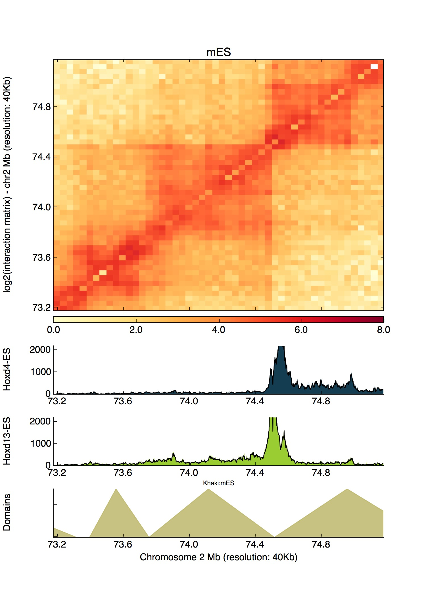
</figure>

## Bar Plots 

_Gene Expression data taken from:_ [Plasschaert et, al. NAR 2014](http://www.ncbi.nlm.nih.gov/pubmed/24121688)

_Color can be specied as a hexadecimal number (-bc 9ACD32) or for each arc by specified RGB colors in bedGraph file._

	python HiCPlotter.py -f data/HiC/Mouse/mES.chr6 -n mES -chr chr6 -r 40000 -o HoxDb -b data/HiC/Mouse/GSE39522_rnaseq_gene_expression.bedGraph -bl GeneExpression -s 2900 -e 3075 -fh 0 -pi 0 -bc 9ACD32 -bm 500 -mm 8 -spi 1

<figure>
  <figcaption align="middle">**Bar plot for gene expression in mouse ES cells**</figcaption>
  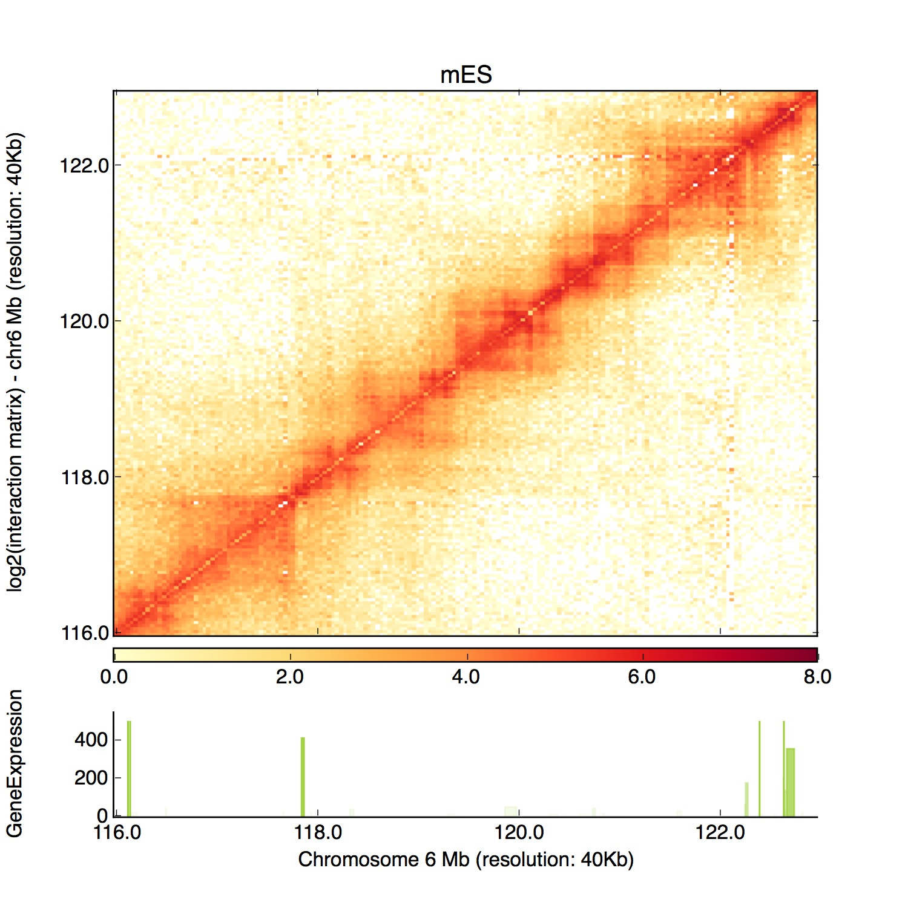
</figure>

## Arcs plotting 

_Arc plots require a bedGraph file (-a file1), color can be specied as a hexadecimal number (-ac B4B4B4) or for each arc by specified RGB colors in bedGraph file._

_Data taken from:_ SMC ChIA-Pet and Polycomb Domains: [Dowen et, al. Cell 2014](http://www.sciencedirect.com/science/article/pii/S0092867414011799), Hi-C and TADs : [Dixon et, al. Nature 2012](http://www.nature.com/nature/journal/v485/n7398/full/nature11082.html?WT.ec_id=NATURE-20120517) and H3K27me3 : [Mouse ENCODE Project](http://www.mouseencode.org/)
	
	python HiCPlotter.py -f data/HiC/Mouse/mES.chr3 -n mES -chr chr3 -o Bhlhe22 -r 40000 -s 400 -e 500 -a data/HiC/Mouse/mESC_SMC_ChIPPet.bed -al SMC -hist data/HiC/Mouse/GSM747534_chr3.bedGraph,data/HiC/Mouse/wgEncodeLicrHistoneEsb4H3k27me3ME0C57bl6StdSig.chr3.bedGraph -hl CTCF,H3K27me3 -pi 0 -ptr 0 -t data/HiC/Mouse/mm9_Polycomb_domains.bed -tl Polycomb -tc 00CCFF -ac B4B4B4 -fh 0

<figure>
  <figcaption align="middle">**Bhlhe22 locus in mouse ES cells**</figcaption>
  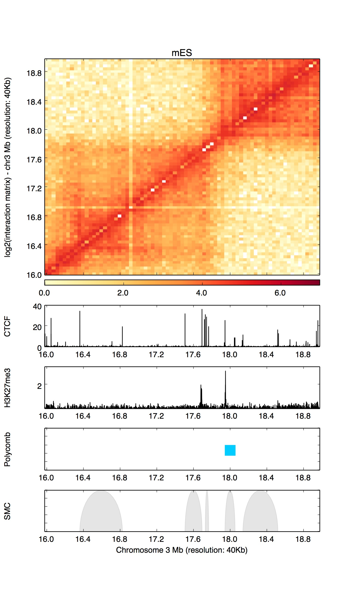
</figure>

## Tiles plotting 

_If bedGraph file for tile plotting contains text in 6th column, features can be plotted above tiles with -tt parameter._

_Data taken from:_ 4C : [Lonfat et, al. Science 2014](http://www.sciencemag.org/content/346/6212/1004.long) (Primer locations in Lonfat et, al. are extended to make them more visible in the plot), Hi-C and TADs : [Dixon et, al. Nature 2012](http://www.nature.com/nature/journal/v485/n7398/full/nature11082.html?WT.ec_id=NATURE-20120517)

	python HiCPlotter.py -f data/HiC/Mouse/mES.chr6 -n mES -chr chr6 -r 40000 -o Digit.vs.GT -s 1295 -e 1338 -hist data/HiC/Mouse/GSM1524258_segToFrag_4C_Digits_WT_E12-5_HoxA13_smoothed_11FragsPerWin.bedGraph,data/HiC/Mouse/GSM1524259_segToFrag_4C_GT_WT_E15-5_HoxA13_smoothed_11FragsPerWin.bedGraph -hl Digits,GT -fhist 1,1 -fh 0 -pi 0 -hm 1500,1500 -pcd 1 -pcdf data/mES_domains_mm9.bed -sn 0.4 -t data/HiC/Mouse/primers.bedGraph -tl Enhancers -tt 1

<figure>
  <figcaption align="middle">**Interaction profiles of Hoxa13 gene with tissue specific enhancers**</figcaption>
  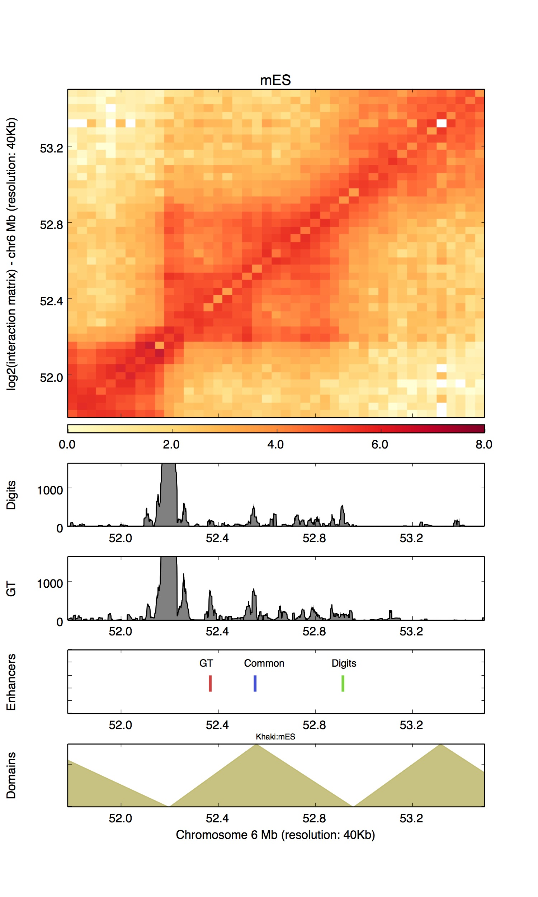
</figure>

## Epilogos plotting 

Epilogos is developed visualization and analysis of chromatin state model data in various cell types by Wouter Meuleman and Manolis Kellis. More about epilogos, [check](http://compbio.mit.edu/epilogos/#)

You can download the epilogos data [from](http://egg2.wustl.edu/roadmap/data/byFileType/chromhmmSegmentations/ChmmModels/epilogos/)

	python HiCPlotter.py -f data/HiC/Human/GM12878-chr10_25kb.RAWobserved_KRnormalizedMatrix.txt -chr chr10 -fh 0 -n GM12878 -o Epilogos -r 25000 -ep qcat -hist RepliSeq.bedGraph -hl RepliSeq -fhist 1 -s 2500 -e 5000 -mm 8

<figure>
  <figcaption align="middle">**Epilogos with Replication Timing and Hi-C data**</figcaption>
  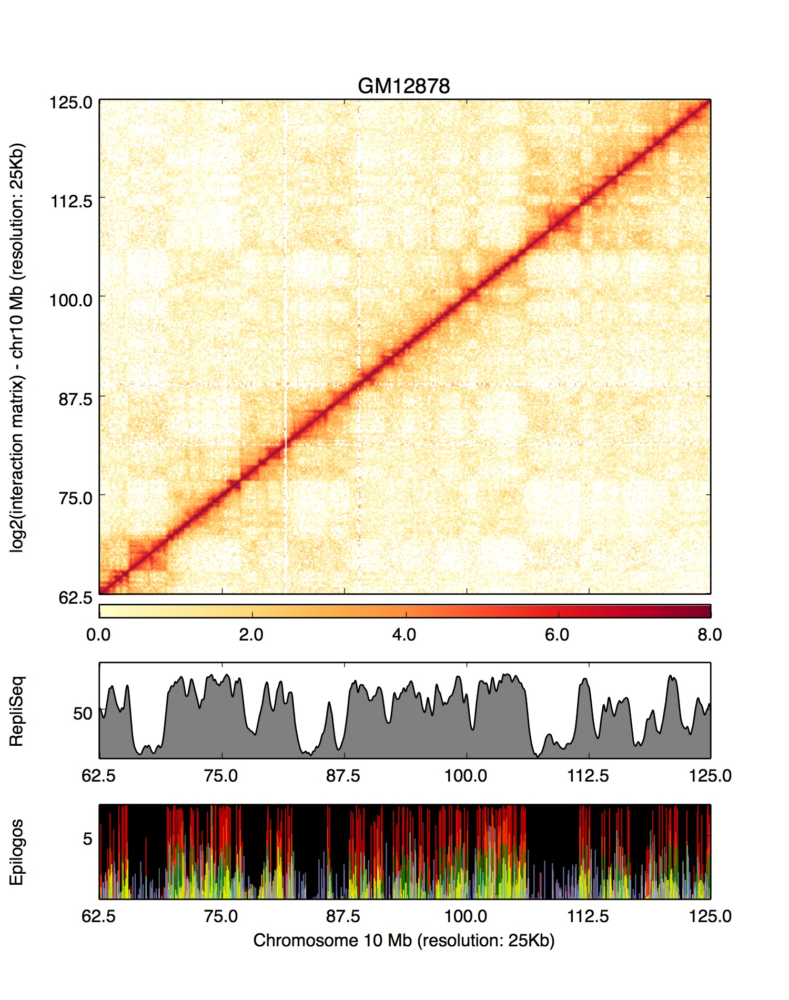
</figure>

_Use parameter (-im) if you download the qcat file from imputed/ folder_
 
_Currently color of each states for Epilogos plotting is hard-coded in HiCPlotter, therefore please use qcat files in imputed or observed folders._

## Highlighting selected loci on the plot 

_Highlights on the plots can be drawn with -high 1 and passing a bed file name to -hf parameter._

_Data taken from:_ Hi-C and Arrow domains  : [Rao et, al. Cell 2014](http://www.cell.com/cell/abstract/S0092-8674\(14\)01497-4), ChIA-Pet [Heidari et, al. Genome Research 2014](http://genome.cshlp.org/content/early/2014/09/15/gr.176586.114), TADs : [Dixon et, al. Nature 2012](http://www.nature.com/nature/journal/v485/n7398/full/nature11082.html?WT.ec_id=NATURE-20120517), ChIP-Seq and Repli-Seq data : [Encode Project](http://www.genome.gov/encode/)

	python HiCPlotter.py -f data/HiC/Human/GM12878-chr10_25kb.RAWobserved_KRnormalizedMatrix.txt data/HiC/Human/K562-chr10_25kb.RAWobserved_KRnormalizedMatrix.txt -n GM12878 K562 -chr chr10 -r 25000 -pi 0 -fh 0 -o ChIA -a data/HiC/Human/GM12878.Rad21.bed data/HiC/Human/K562.Rad21.bed -al ChIA-PET ChIA-PET -s 3000 -e 3500 -pcd 1 -pcdf data/HiC/Human/GM12878_Arrowhead_domainlist.bed data/HiC/Human/K562_Arrowhead_domainlist.bed -hist data/HiC/Human/wgEncodeUwDnaseGm12878RawRep2.chr10.bedGraph,data/HiC/Human/wgEncodeBroadHistoneGm12878CtcfStdSig.chr10.bedGraph,data/HiC/Human/wgEncodeUwRepliSeqGm12878WaveSignalRep1.bedGraph data/HiC/Human/wgEncodeUwDnaseK562RawRep2.chr10.bedGraph,data/HiC/Human/wgEncodeBroadHistoneK562CtcfStdSig.chr10.bedGraph,data/HiC/Human/wgEncodeUwRepliSeqK562WaveSignalRep1.bedGraph -hl DNAse,CTCF,RepliSeq DNAse,CTCF,RepliSeq -fhist 0,0,1 0,0,1 -pptd 1 -high 1 -hf data/HiC/Human/highlight.bed

<figure>
  <figcaption align="middle">**Interaction profiles in chromosome 10 of GM12878 and K562 cells.**</figcaption>
  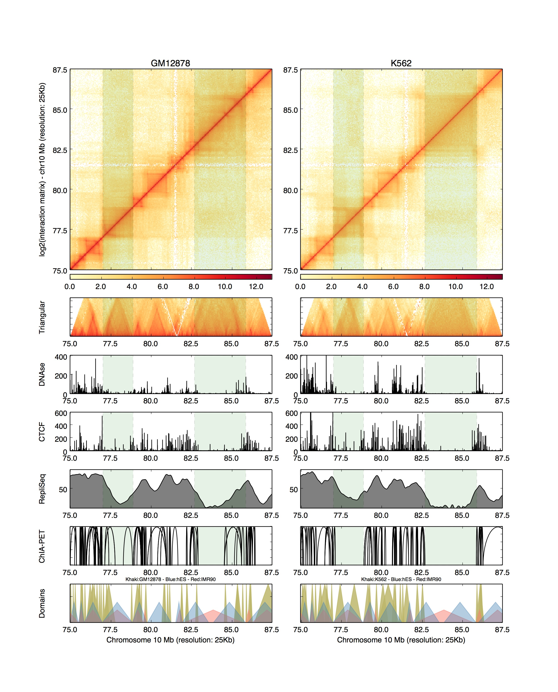
</figure>

## Annotating the interaction matrix 

_Annotations on the matrix can be drawn with -peak parameter.Input file should contain at least six columns._

_Data taken from:_ Hi-C and HiCCUP peaks  : [Rao et, al. Cell 2014](http://www.cell.com/cell/abstract/S0092-8674\(14\)01497-4)

 	python HiCPlotter.py -f data/HiC/Human/GM12878-chr10_25kb.RAWobserved_KRnormalizedMatrix.txt data/HiC/Human/KBM7-chr10_25kb.RAWobserved_KRnormalizedMatrix.txt data/HiC/Human/K562-chr10_25kb.RAWobserved_KRnormalizedMatrix.txt data/HiC/Human/HUVEC-chr10_25kb.RAWobserved_KRnormalizedMatrix.txt data/HiC/Human/IMR90-chr10_25kb.RAWobserved_KRnormalizedMatrix.txt data/HiC/Human/HMEC-chr10_25kb.RAWobserved_KRnormalizedMatrix.txt data/HiC/Human/NHEK-chr10_25kb.RAWobserved_KRnormalizedMatrix.txt -n GM12878 KBM7 K562 HUVEC IMR90 HMEC NHEK -r 25000 -pi 0 -fh 0 -o Loops -chr chr10 -peak data/HiC/Human/GSE63525_GM12878_replicate_HiCCUPS_looplist.bed data/HiC/Human/GSE63525_KBM7_HiCCUPS_looplist.bed data/HiC/Human/GSE63525_K562_HiCCUPS_looplist.bed data/HiC/Human/GSE63525_HUVEC_HiCCUPS_looplist.bed data/HiC/Human/GSE63525_IMR90_HiCCUPS_looplist.bed data/HiC/Human/GSE63525_HMEC_HiCCUPS_looplist.bed data/HiC/Human/GSE63525_NHEK_HiCCUPS_looplist.bed -s 3600 -e 3675  -ptr 0

<figure>
  <figcaption align="middle">**Significantly interaction loci (peaks) in several cell lines.**</figcaption>
  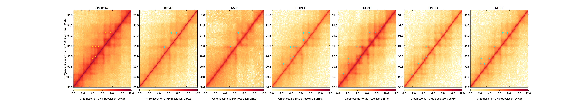
</figure>

## Whole Genome Plotting 

_Whole genome plotting can be activated by -wg parameter (Please note: currently only matrixes can be plotted with this option)._

_Data taken from:_ Hi-C : [Seitan et, al. Genome Research 2014](http://genome.cshlp.org/cgi/pmidlookup?view=long&pmid=24002784)
	
 	python HiCPlotter.py -f data/HiC/Human/GSM1184323-HiCMYZ-Tcell-Rad21WT-R1.mm9.NA.L-1400000-wDiag-noSS-iced.2.matrix data/HiC/Human/GSM1184321-HiCMYZ-Tcell-Rad21KO-R1.mm9.NA.L-1400000-wDiag-noSS-iced.2.matrix -n Tcell_WT Tcell_Rad21KO -chr Genome -r 1400000 -o Tcell -pi 0 -ptr 0 -wg 1 -hmc 5 -fh 4

<figure>
  <figcaption align="middle">**T-cell whole genome interaction data in wild type and Rad21 knock-out cells**</figcaption>
  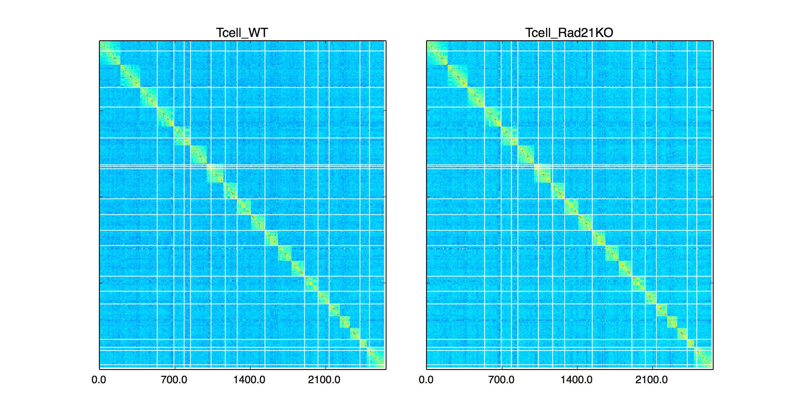
</figure>

### Whole genome plotting with triple sparse files

_(-chr) parameter will be used designate to the end chromosome, such as (-chr chr11) will plot interactions starting from chr1 to chr11._ 

<figure>
  <figcaption align="middle">**hES whole genome interactions**</figcaption>
  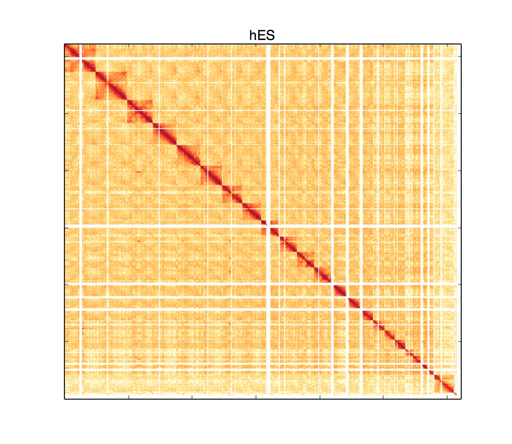
</figure>

_Please use (-chr chrY) for whole genome interaction plots._

<figure>
  <figcaption align="middle">**hES interactions from chr1 to chr11**</figcaption>
  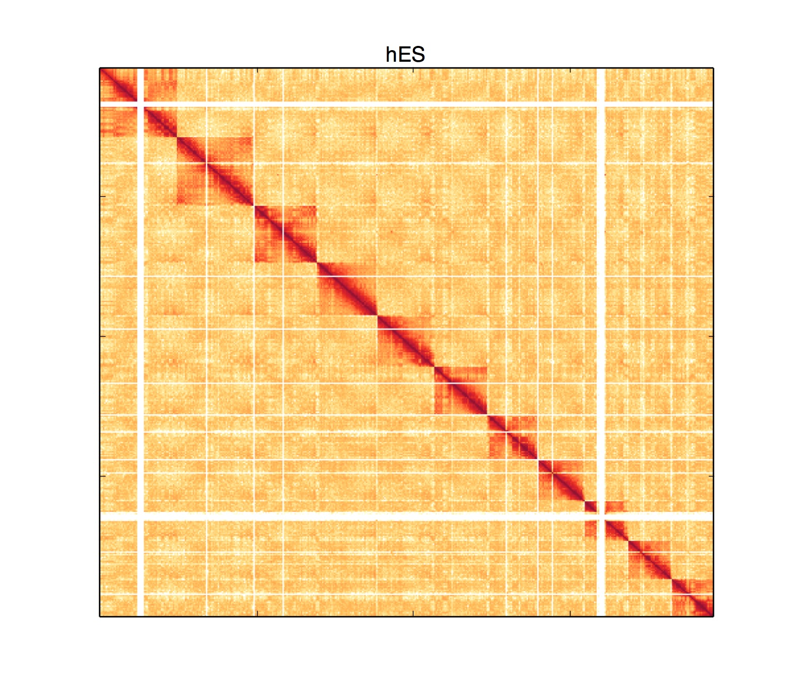
</figure>

## 5C data visualization 

_Random binned 5C data plotting can be activated by -rb parameter (Please note: currently only matrixes and triangular plots can be plotted with this option)._

_Data taken from:_ 5C data [Nora et, al. Nature 2012](http://www.nature.com/nature/journal/v485/n7398/full/nature11049.html)

 	python HiCPlotter.py -f data/5C/GSM873926_mESCs-female-PGK12.1-day2-Replicate1.txt data/5C/GSM873932_femaleXO-mESCs-DXTX-replicate-1.matrix.txt data/5C/GSM873924_female-MEFs-replicate-1.matrix.txt -n mESC mESC_XO MEF -fh 8 -chr chrX -o 5C -sn 2 -pi 0 -rb 1 -e 300 -hmc 5

<figure>
  <figcaption align="middle">**Xist locus in mouse ES, mouse ES Xist deletion and MEF cells**</figcaption>
  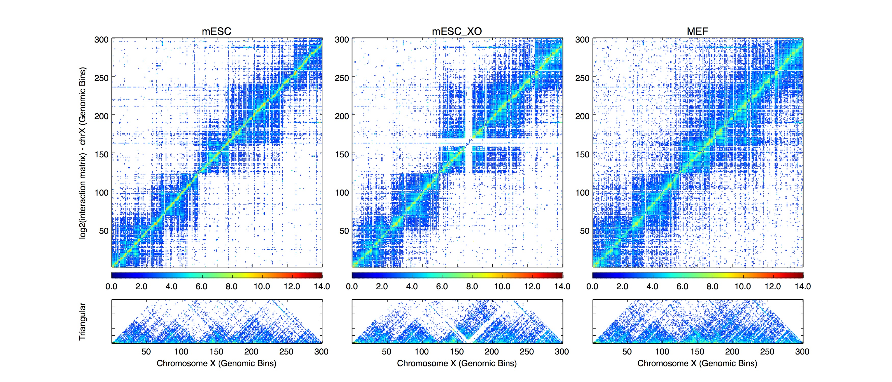
</figure>

## Comparing Hi-C matrices 

_Hi-C matrices can be compared by using -c parameter, which will generate log2 comparison matrix for the first two matrices._
	
	python HiCPlotter.py -f data/HiC/Human/HUVEC-chr10_25kb.RAWobserved_KRnormalizedMatrix.txt data/HiC/Human/IMR90-chr10_25kb.RAWobserved_KRnormalizedMatrix.txt -chr chr10 -n HUVEC IMR90 -o comparison -s 4850 -e 5400 -mm 8 -r 25000 -c 1 -t data/HiC/Human/HUVEC_18_core_K27ac_dense2.bed data/HiC/Human/IMR90_18_core_K27ac_dense2.bed -tl States States -spi 1 -hist data/HiC/Human/wgEncodeUwRepliSeqHuvecWaveSignalRep1.bedGraph data/HiC/Human/wgEncodeUwRepliSeqImr90WaveSignalRep1.bedGraph -hl RepliSeq RepliSeq -fhist 1 1

<figure>
  <figcaption align="middle">**Comparing HUVEC and IMR90 cell lines**</figcaption>
  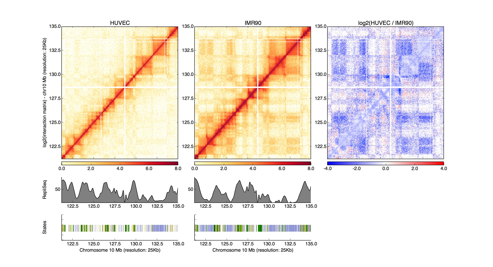
</figure>

_For pair-wise matrix comparisons in addition to -c parameter, also use -p parameter which will plot comparison matrices for each pair of matrices._

_Warning: can be memory inefficient for high-resolution matrices._

	python HiCPlotter.py -f HUVEC-chr21_25kb.RAWobserved_KRnormalizedMatrix.txt NHEK-chr21_25kb.RAWobserved_KRnormalizedMatrix.txt HMEC-chr21_25kb.RAWobserved_KRnormalizedMatrix.txt -n HUVEC NHEK HMEC -chr chr21 -r 25000 -o pair -c 1 -p 1 -spi 1 -mm 8 -s 650 -e 1210 -t HUVEC.E122.states.bed NHEK.E127.states.bed HMEC.E119.states.bed -tl States States States

<figure>
  <figcaption align="middle">**Pair-wise comparisons**</figcaption>
  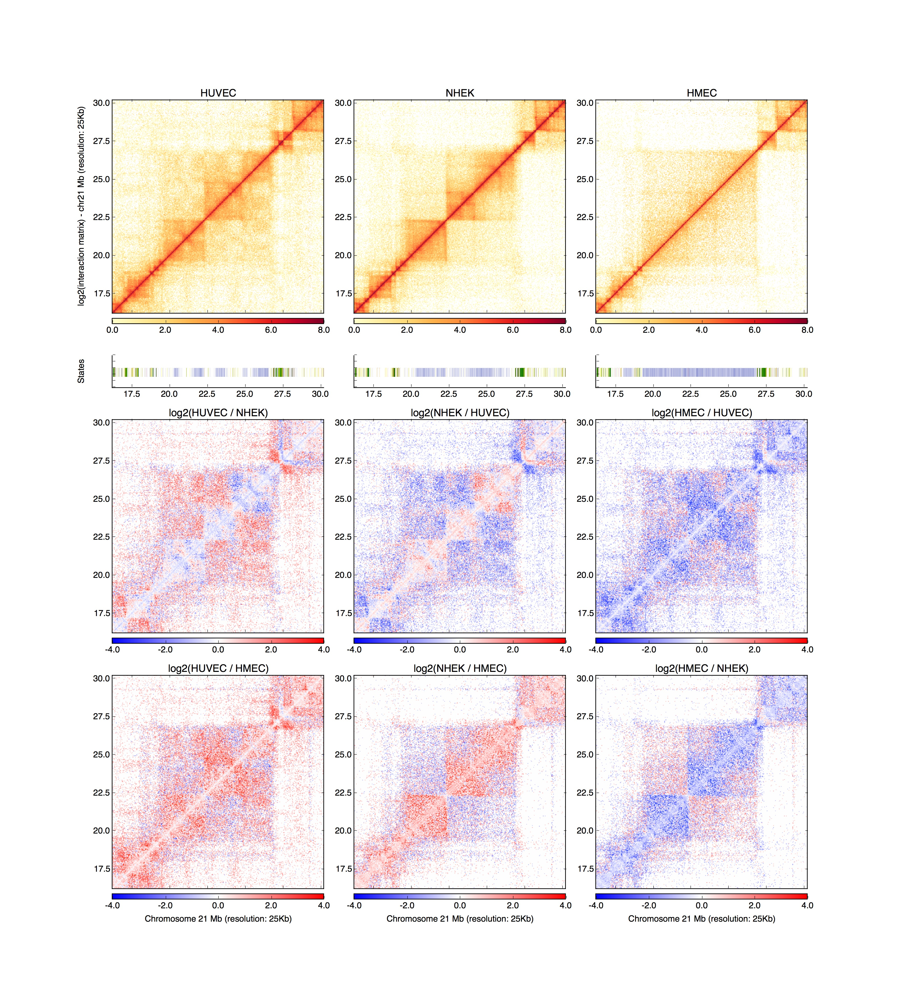
</figure> 

# Reproducing the figures in our Genome Biology article

## Basic usage

	python HiCPlotter.py -f data/HiC/Human/GM12878-chr10_25kb.RAWobserved_KRnormalizedMatrix.txt data/HiC/Human/K562-chr10_25kb.RAWobserved_KRnormalizedMatrix.txt data/HiC/Human/HUVEC-chr10_25kb.RAWobserved_KRnormalizedMatrix.txt data/HiC/Human/NHEK-chr10_25kb.RAWobserved_KRnormalizedMatrix.txt data/HiC/Human/IMR90-chr10_25kb.RAWobserved_KRnormalizedMatrix.txt -n GM12878 K562 HUVEC NHEK IMR90 -chr chr10 -r 25000 -s 3000 -e 3250 -o Figure1 -fh 0

<figure>
  <figcaption align="middle">**Basic Usage of HiCPlotter**</figcaption>
  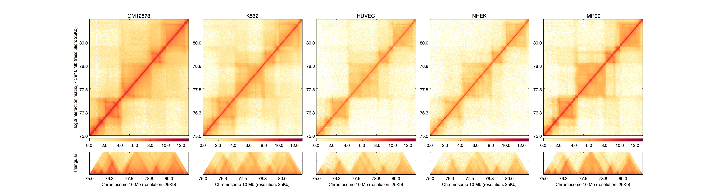
</figure>

## Adding tracks

	python HiCPlotter.py -f data/HiC/Human/GM12878-chr10_25kb.RAWobserved_KRnormalizedMatrix.txt data/HiC/Human/K562-chr10_25kb.RAWobserved_KRnormalizedMatrix.txt data/HiC/Human/HUVEC-chr10_25kb.RAWobserved_KRnormalizedMatrix.txt data/HiC/Human/NHEK-chr10_25kb.RAWobserved_KRnormalizedMatrix.txt data/HiC/Human/IMR90-chr10_25kb.RAWobserved_KRnormalizedMatrix.txt -n GM12878 K562 HUVEC NHEK IMR90 -chr chr10 -r 25000 -s 3000 -e 3500 -o Figure2 -hist data/HiC/Human/wgEncodeUwDnaseGm12878RawRep2.chr10.bedGraph,data/HiC/Human/wgEncodeBroadHistoneGm12878CtcfStdSig.chr10.bedGraph,data/HiC/Human/wgEncodeUwRepliSeqGm12878WaveSignalRep1.bedGraph data/HiC/Human/wgEncodeUwDnaseK562RawRep2.chr10.bedGraph,data/HiC/Human/wgEncodeBroadHistoneK562CtcfStdSig.chr10.bedGraph,data/HiC/Human/wgEncodeUwRepliSeqK562WaveSignalRep1.bedGraph data/HiC/Human/wgEncodeUwDnaseHuvecRawRep2.chr10.bedGraph,data/HiC/Human/wgEncodeBroadHistoneHuvecCtcfStdSig.chr10.bedGraph,data/HiC/Human/wgEncodeUwRepliSeqHuvecWaveSignalRep1.bedGraph data/HiC/Human/wgEncodeUwDnaseNhekRawRep2.chr10.bedGraph,data/HiC/Human/wgEncodeBroadHistoneNhekCtcfStdSig.chr10.bedGraph,data/HiC/Human/wgEncodeUwRepliSeqNhekWaveSignalRep1.bedGraph data/HiC/Human/wgEncodeOpenChromDnaseImr90BaseOverlapSignal.chr10.bedGraph,data/HiC/Human/wgEncodeSydhTfbsImr90CtcfbIggrabSig.chr10.bedGraph,data/HiC/Human/wgEncodeUwRepliSeqImr90WaveSignalRep1.bedGraph -fh 0 -fhist 0,0,1 0,0,1 0,0,1 0,0,1 0,0,1 -hl DNAse,CTCF,RepliSeq DNAse,CTCF,RepliSeq DNAse,CTCF,RepliSeq DNAse,CTCF,RepliSeq DNAse,CTCF,RepliSeq -hm 400,600,100 400,600,100 400,600,100 400,600,100 400,600,100 -pcd 1 -pcdf data/HiC/Human/GM12878_Arrowhead_domainlist.bed data/HiC/Human/K562_Arrowhead_domainlist.bed data/HiC/Human/HUVEC_Arrowhead_domainlist.bed data/HiC/Human/NHEK_Arrowhead_domainlist.bed data/HiC/Human/IMR90_Arrowhead_domainlist.txt -t data/HiC/Human/GM12878_18_core_K27ac_dense2.bed data/HiC/Human/K562_18_core_K27ac_dense2.bed data/HiC/Human/HUVEC_18_core_K27ac_dense2.bed data/HiC/Human/NHEK_18_core_K27ac_dense2.bed data/HiC/Human/IMR90_18_core_K27ac_dense2.bed -tl ChromHMM ChromHMM ChromHMM ChromHMM ChromHMM -pptd 1 -high 1 -hf data/HiC/Human/fig2.bed 

<figure>
  <figcaption align="middle">**Adding tracks**</figcaption>
  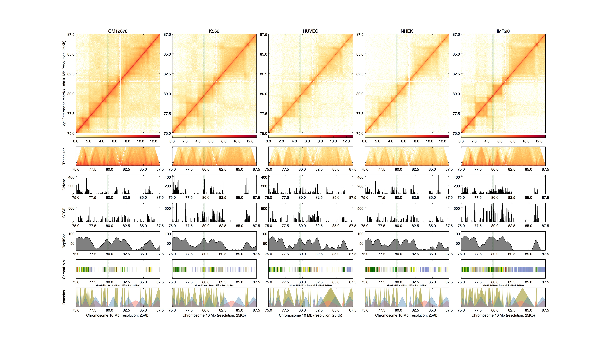
</figure>

## Cohesin ChIA-PET interactions coincide with early replication sites

	python HiCPlotter.py -f data/HiC/Human/GM12878-chr15_25kb.RAWobserved_KRnormalizedMatrix.txt data/HiC/Human/K562-chr15_25kb.RAWobserved_KRnormalizedMatrix.txt -n GM12878 K562 -chr chr15 -r 25000 -s 1800 -e 2250 -o Figure3 -hist data/HiC/Human/wgEncodeUwDnaseGm12878RawRep1.chr15.bedGraph,data/HiC/Human/wgEncodeBroadHistoneGm12878CtcfStdSig.chr15.bedGraph,data/HiC/Human/wgEncodeUwRepliSeqGm12878WaveSignalRep1.bedGraph data/HiC/Human/wgEncodeUwDnaseK562RawRep1.chr15.bedGraph,data/HiC/Human/wgEncodeBroadHistoneK562CtcfStdSig.chr15.bedGraph,data/HiC/Human/wgEncodeUwRepliSeqK562WaveSignalRep1.bedGraph -fh 0 -fhist 0,0,1 0,0,1 -hl DNase,CTCF,RepliSeq DNase,CTCF,RepliSeq -hm 400,400,100 400,400,100 -t data/HiC/Human/GM12878_Enhancer.bed,data/HiC/Human/GM12878_Txn.bed,data/HiC/Human/GM12878_Het.bed data/HiC/Human/K562_Enhancer.bed,data/HiC/Human/K562_Txn.bed,data/HiC/Human/K562_Het.bed -tl Enhancer,Transcribed,Heterochromatin Enhancer,Transcribed,Heterochromatin -a data/HiC/Human/GM12878.Rad21.bed data/HiC/Human/K562.Rad21.bed -al RAD21 RAD21 -ptr 0 -high 1 -hf data/HiC/Human/fig3.bed

<figure>
  <figcaption align="middle">**Cohesin ChIA-PET interactions coincide with early replication sites**</figcaption>
  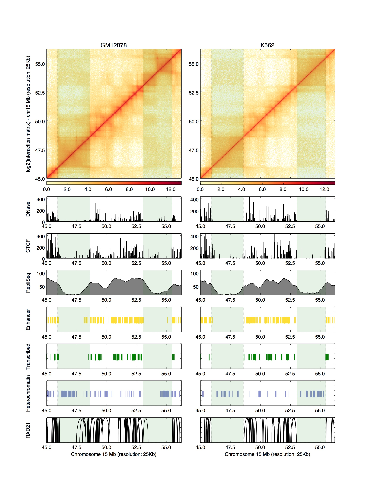
</figure>

## A lincRNA locus exhibits active chromatin formation in K562 cells

	python HiCPlotter.py -f data/HiC/Human/GM-chr19_25kb.RAWobserved_KRnormalizedMatrix.txt data/HiC/Human/K562-chr19_25kb.RAWobserved_KRnormalizedMatrix.txt -n GM12878 K562 -r 25000 -chr chr19 -hist data/HiC/Human/GM12878.DNAse.chr19.2.bedGraph,data/HiC/Human/GM12878.RnaSeq.chr19.2.bedGraph,data/HiC/Human/wgEncodeUwRepliSeqGm12878WaveSignalRep1.bedGraph data/HiC/Human/K562.DNAse.chr19.2.bedGraph,data/HiC/Human/K562.RnaSeq.chr19.2.bedGraph,data/HiC/Human/wgEncodeUwRepliSeqK562WaveSignalRep1.bedGraph -hl DNAse,RNASeq,RepliSeq DNAse,RNASeq,RepliSeq -t data/HiC/Human/GM12878_TSS+Trx.2.bed data/HiC/Human/K562_TSS+Trx.2.bed -tl ChromHMM ChromHMM -high 1 -hf data/HiC/Human/region.bed -o Figure4 -s 1100 -e 1302 -hm 300,300,100 300,300,100 -fh 0 -fhist 0,0,1 0,0,1 -ptr 0

<figure>
  <figcaption align="middle">**A lincRNA locus exhibits active chromatin formation in K562 cells**</figcaption>
  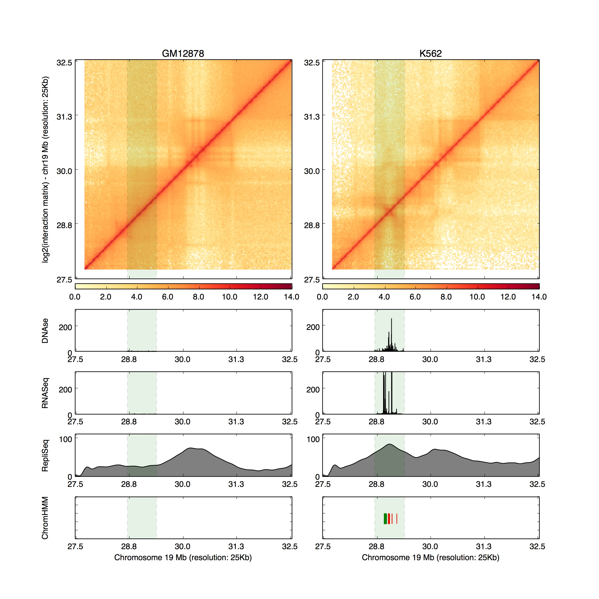
</figure>

# Tips

*If your data contains several columns before data matrix, from command line you could use: 
	
	cut -f N- matrix > new_matrix (where N is the ith column data values start)

*If any of the imported packages are missing in your python system, try to comment out those lines. For example:

	Original  :     from scipy.signal import argrelextrema (line 20)
	Try this  :     #from scipy.signal import argrelextrema (line 20). Use HiCPlotter with the -pi 0 and -ptd 0

*If you like to run HiCPlotter in verbose mode, please use -v parameter which will create a log file with which parameters the program ran.

*If you need to convert bigWig files to bedGraph files, you can use kentUtils/bigWigToBedGraph executable.

# Help:

If you encounter any problems, please contact with - Kadir Akdemir (kcakedemir at mdanderson dot org).

# License

The MIT License (MIT)

Copyright (c) 2015, Kadir C. Akdemir and Lynda Chin

Permission is hereby granted, free of charge, to any person obtaining a copy
of this software and associated documentation files (the "Software"), to deal
in the Software without restriction, including without limitation the rights
to use, copy, modify, merge, publish, distribute, sublicense, and/or sell
copies of the Software, and to permit persons to whom the Software is
furnished to do so, subject to the following conditions:

The above copyright notice and this permission notice shall be included in
all copies or substantial portions of the Software.

THE SOFTWARE IS PROVIDED "AS IS", WITHOUT WARRANTY OF ANY KIND, EXPRESS OR
IMPLIED, INCLUDING BUT NOT LIMITED TO THE WARRANTIES OF MERCHANTABILITY,
FITNESS FOR A PARTICULAR PURPOSE AND NONINFRINGEMENT. IN NO EVENT SHALL THE
AUTHORS OR COPYRIGHT HOLDERS BE LIABLE FOR ANY CLAIM, DAMAGES OR OTHER
LIABILITY, WHETHER IN AN ACTION OF CONTRACT, TORT OR OTHERWISE, ARISING FROM,
OUT OF OR IN CONNECTION WITH THE SOFTWARE OR THE USE OR OTHER DEALINGS IN
THE SOFTWARE.

# Acknowledgements

Thanks to Lynda Chin and Andy Futreal for their leadership, management and support.

Thanks to Zeynep Coban-Akdemir, Ian Watson, Denise Spring, Jason Ernst, Tony Gutschner, Kunal Rai and Samir Amin for their insightful comments.

We are grateful to many researchers cited above for providing their data in publicly available and easy-to-use format.
